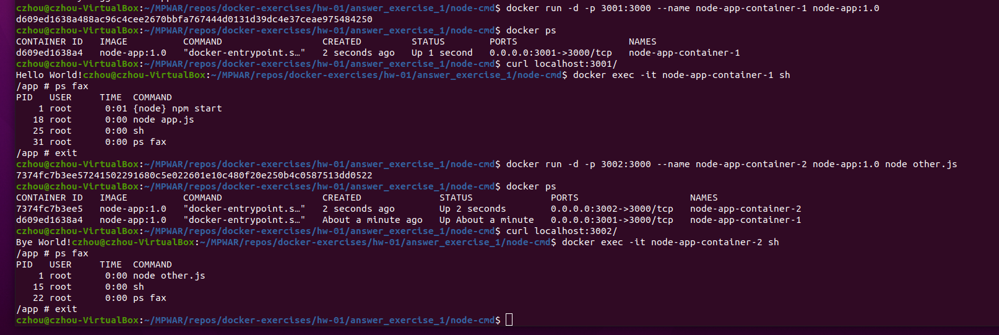
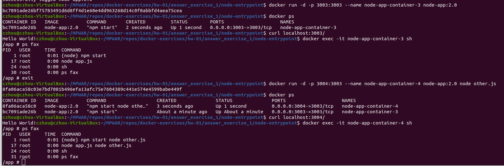
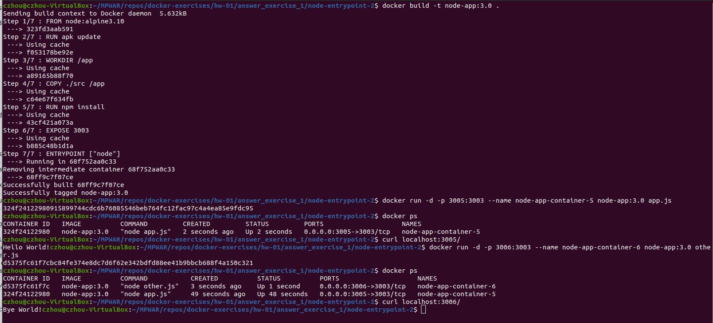
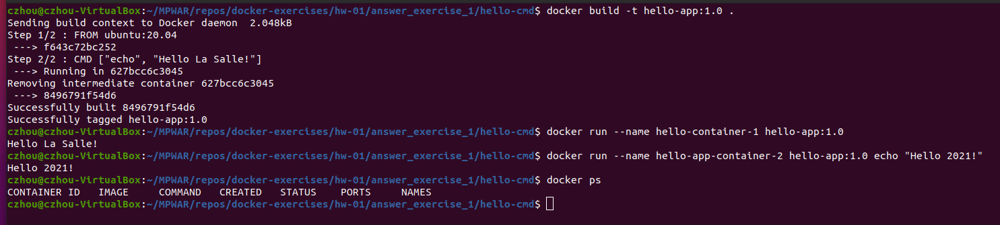
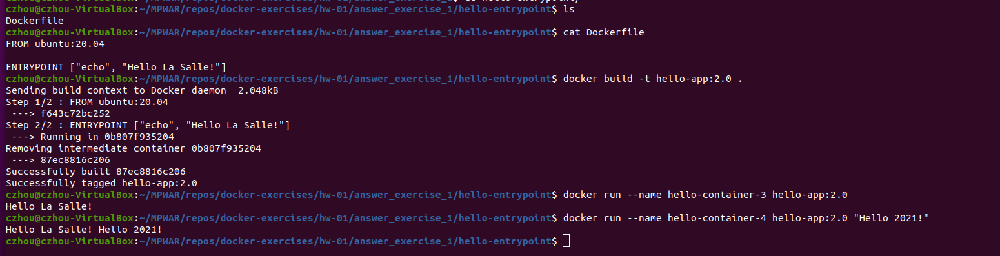

# hw-01-exercise-01

Indica la diferencia entre el uso de la instrucción CMD y ENTRYPOINT
(Dockerfile)

## CMD vs ENTRYPOINT

A partir de un Dockerfile podemos construir una imagen. En el mismo podemos definir un comando a ejecutar por defecto para cuando se arranquen contenedores a partir de dicha imagen. Tanto CMD como ENTRYPOINT sirven para esto.

Con **CMD** podemos sobreescribir el comando por defecto especificando otro por CLI al iniciar el contenedor. Esto está bien si se busca parametrizar el punto de entrada y dar más flexibilidad al usuario de la imagen; tener un comando por defecto fácilmente sobreescribible puede ser lo deseado, por ejemplo, en fases de desarrollo (es más fácil debuggar).

Con **ENTRYPOINT** no se sobreescribe el comando por defecto (a no ser que se añada el flag --entrypoint.), aunque se le pueden añadir variables como argumentos. Es preferible cuando queremos tratar el contenedor como un ejecutable; queremos que haya un comando que siempre se ejecute y que no sea fácilmente modificable por el usuario. Por ejemplo, podemos tener una herramienta implementada como un script en C# y no queremos que el usuario se tenga que preocupar de instalar versiones o dependencias específicas. Lo podemos empaquetar todo en una imagen con un ENTRYPOINT que referencie a nuestro script. Con CMD se podría hacer igual, pero de esta otra manera queda más claro que el contenedor está pensado para ejecutarse con este comando concreto.

Según el caso, lo ideal también puede ser **combinar ambas instrucciones** para, por un lado, apuntar a la aplicación principal a ejecutar (ENTRYPOINT) y, por otro, definir unos parámetros por defecto que se puedan sobreescribir fácilmente (CMD). Para esto se tienen que definir ENRYPOINT Y CMD en formato exec.

Si tenemos un contenedor publicado en un repositorio público, usar solo CMD hace que sea más vulnerable: se puede entrar dentro del contenedor sobreescribiendo con un docker exec -it containerName sh, por ejemplo (puedo hacer ls, cat de ficheros...). Con entrypoint no es tan fácil.

### Ejemplos

#### A. node-app
_(archivos en carpetas node-cmd y node-entrypoint)_

CMD
  - Dockerfile
  ~~~
    FROM node:alpine3.10

    RUN apk update

    WORKDIR /app

    COPY ./src /app

    RUN npm install

    EXPOSE 3000

    CMD [npm", "start"]
  ~~~

  - Build
  ~~~
  docker build -t node-app:1.0 .
  ~~~

  - Run
  ~~~
  docker run -d -p 3001:3000 --name node-app-container-1 node-app:1.0
  ~~~

  - Check

   1. docker ps
      	- vemos nuestro contenedor corriendo
   2. curl localhost:3001/
      	- vemos el mensaje Hello World!
   3. docker exec -it node-app-container-1 sh > ps fax
      	- vemos que está corriendo la aplicación (PID 1)
   4. docker run -d -p 3002:3000 --name node-app-container-2 node-app:1.0 node other.js
      	- sobreescribimos el CMD definido en el Dockerfile por sh y vemos que ya no arranca con app.js sino con other.js y se ve el mensaje _Bye World!_
      	
   

ENTRYPOINT
  - Dockerfile
  ~~~
    FROM node:alpine3.10

    RUN apk update

    WORKDIR /app

    COPY ./src /app

    RUN npm install

    EXPOSE 3003

    ENTRYPOINT [npm", "start"]
  ~~~

  - Build
  ~~~
  docker build -t node-app:2.0 .
  ~~~

  - Run
  ~~~
  docker run -d -p 3003:3003 --name node-app-container-3 node-app:2.0
  ~~~

  - Check
  
   1. docker ps
      	- vemos nuestro contenedor corriendo
   2. curl localhost:3003/
      	- vemos el mensaje Hello World!
   3. docker exec -it node-app-container-3 sh > ps fax
      	- vemos que está corriendo la aplicación (PID 1)
   4. docker run -d -p 3004:3003 --name node-app-container-4 node-app:2.0 node other.js 
      	- vemos que no se sobreescribe el comando "npm start" definido como entrypoint de la aplicación.
      	
   
   
   5. Si modificásemos el Dockerfile pasando de ENTRYPOINT ["npm", "start"] a ENTRYPOINT ["node"] y volviésemos a construir una imagen node-app:3.0:
      	- Al hacer _docker run -d -p 3005:3003 --name node-app-container-5 node-app:3.0 app.js_, se iniciaría el contenedor ejecutando el comando _node_ con _app.js_ como argumento (_app.js_ es un archivo que tiene que estar dentro del contenedor).
      	- Esto es útil, por ejemplo, para no tener que instalar en tu máquina múltiples versiones de node; podemos tener varios contenedores con diferentes versiones, corriendo con node y pasándole nosotros como argumento nuestro script.
      	
    

#### B. hello
_(archivos en carpetas hello-cmd y hello-entrypoint)_

CMD
  - Dockerfile
  ~~~
  FROM ubuntu:20.04

  CMD ["echo", "Hello La Salle!"]
  ~~~

  - Build
  ~~~
  docker build -t hello-app:1.0 .
  ~~~

  - Run
  ~~~
  docker run --name hello-container-1 hello-app:1.0
  ~~~
  output: _Hello La Salle!_

  - Play
  ~~~
  docker run --name hello-app-container-2 hello-app:1.0 echo "Hello 2021!"
  ~~~
  output: _Hello 2021!_

  Vemos que hemos sobreescrito el  _Hello La Salle!_
  
  

ENTRYPOINT
  - Dockerfile
  ~~~
  FROM ubuntu:20.04

  ENTRYPOINT ["echo", "Hello La Salle!"]
  ~~~

  - Build
  ~~~
  docker build -t hello-app:2.0 .
  ~~~

  - Run
  ~~~
  docker run --name hello-container-3 hello-app:2.0
  ~~~
  output: _Hello La Salle!_

  - Play
  ~~~
  docker run --name hello-container-4 hello-app:2.0 "Hello 2021!"
  ~~~
  output: _Hello La Salle! Hello 2021!_

  Vemos que se ejecuta el ENTRYPOINT definido en el Dockerfile pero se le añade un argumento nuevo, no se sobreescribe.
  
  

## Summary

**CMD**
- CMD permite definir un comando por defecto que se ejecturá cuando se arranque el contenedor por CLI sin especificar un comando adicional. Si se especifica, se sobreescribe el indicado por defecto.
- Si el Dockerfile tiene más de una instrucción CMD, se aplica la última.
- Formas de definición:
  - CMD ["comando","parámetro1","parámetro2"] (_exec form_ - preferible)
  - CMD ["parámetro1","parámetro2"] (para cuando se combina con ENTRYPOINT, define los parámetros por defecto que se añadirán después de lo definido en ENTRYPOINT)
  - CMD comando parámetro1 parámetro2 (_shell form_)
- Ejemplo de contexto de uso: durante la fase de desarrollo (más fácil debugar)

**ENTRYPOINT**
- Como CMD, instruction, permite definir un comando por defecto que se ejecturá cuando se arranque el contenedor. Cualquier otra especificación por CLI se interpretará como argumento extra al comando definido.
- Solo puede haber uno.
- Formas de definición:
  - ENTRYPOINT ["comando", "parámetro1", "parámetro2"] (_exec form_ - preferible)
  - ENTRYPOINT comando parámetro1 parámetro2 (_shell form_)
-	Ejemplo de contexto de uso: para subir a producción.

