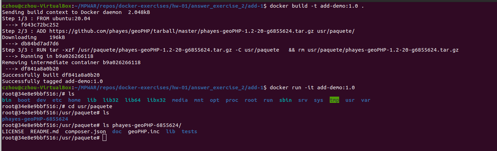
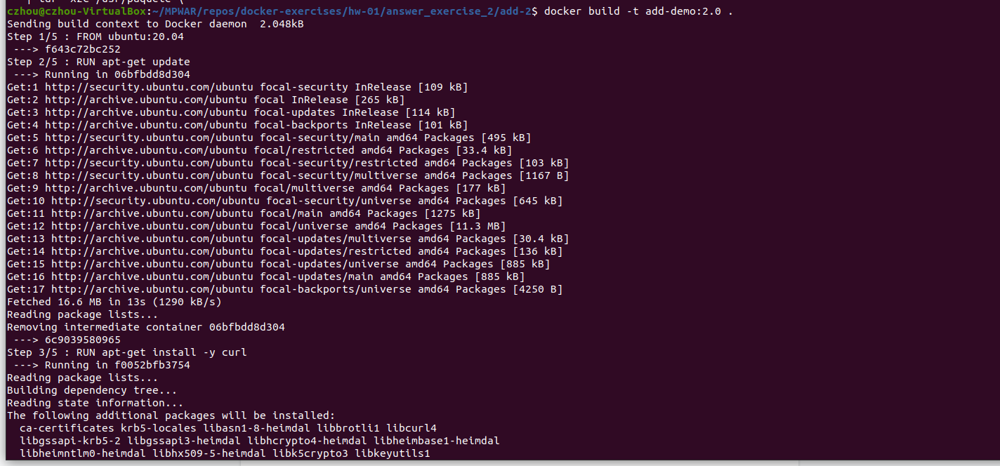
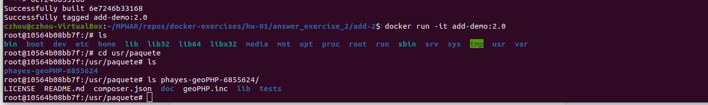

# hw-01-exercise-02

Indica la diferencia entre el uso de la instrucción ADD y COPY (Dockerfile)

## ADD vs COPY

Tanto ADD como COPY sirven para añadir directorios y ficheros a una imagen a construir, especificando el origen y el path de destino en el filesystem del contenedor.

~~~~
ADD [origen] [destino]

COPY [origen] [destino]
~~~~

Cronológicamente, ADD es una intrucción que forma parte de Docker desde los inicios. Además de permitir copiar archivos del contexto de construcción, permite usar una URL como el parámetro de [origen]; el archivo se descarga de la URL especificada y se copia en el [destino]:

~~~~
Caso A: ADD http://ejemplo.com/descarga.cs /carpeta/archivo.cs

Caso B: ADD http://ejemplo.com/descarga.cs /carpeta/
~~~~

- A. El descarga.cs se añadirá al directorio de destino como archivo.cs.

- B. El archivo se guardará en el directorio con el filename de la URL, descarga.cs.

ADD también permite descomprimir archivos automáticamente. Si en [origen] tenemos un archivo en un formato comprimido reconocido (identity, gzip, bzip2, xz), se descomprimirá en el [destino]:

~~~~
ADD /paquete.tar.gz /carpeta/
~~~~

Sin embargo, no se pueden combinar las funcionalidades de descarga y descompresión al mismo tiempo. Si se descarga un archivo comprimido, no se descomprimirá automáticamente. Solo se descomprimen archivos copiados del contexto local.

La posibilidad de añadir archivos locales y remotos, junto con el descomprimir y no-descomprimir según el caso, hacen que la instrucción ADD sea versátil pero poco predecible.

Para resolver esta falta de transparencia a la vez que se mantenía la retrocompatibilidad, se decidió añadir la instrucción COPY. Esta no permite URLs/archivos remotos como [origen]. Todo debe estar el contexto de construcción local. Tampoco descomprime en [destino] archivos comprimidos en [origen]; se copia todo tal y como está.

La buena práctica es usar COPY en lugar de ADD, y dejar este último para casos muy específicos.

Por ejemplo, si por cualquiera de estos casos se necesitase descargar un archivo remoto y auto-descomprimirlo, en lugar de definir las instrucciones como:

~~~~
ADD http://ejemplo.com/paquete.tar.gz usr/paquete/

RUN tar -xzf /carpeta/paquete.tar.gz -C usr/paquete \
  && rm usr/paquete/paquete.tar.gz
~~~~

- La instrucción ADD descarga el paquete remoto desde la URL especificada.
- La instrucción RUN lo descomprime y elimina el archivo descargado.

Ejemplo en carpeta _add-1_:

Sería mejor optar por curl o wget:

~~~~
RUN curl http://ejemplo.com/paquete.tar.gz \
  | tar -xzC /usr/paquete \
~~~~

- Aquí obtenemos el paquete y lo pasamos directamente al comando _tar_ para la extracción. De esta manera no tenemos un archivo en el filesystem que nos interese limpiar/eliminar.

Ejemplo en carpeta _add-2_:

