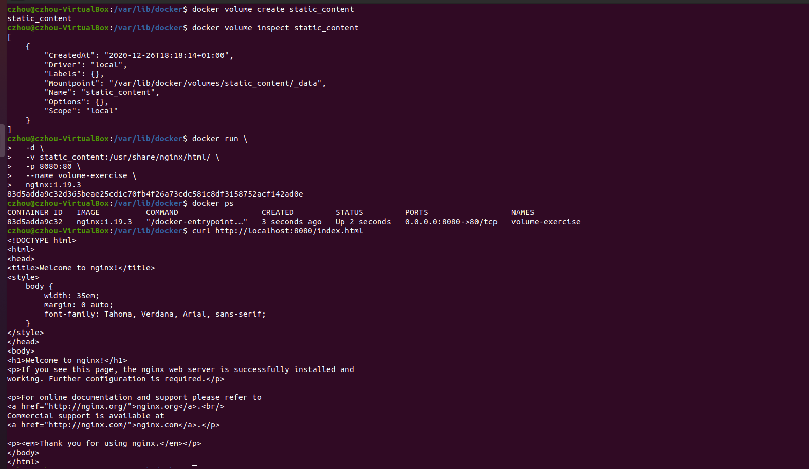
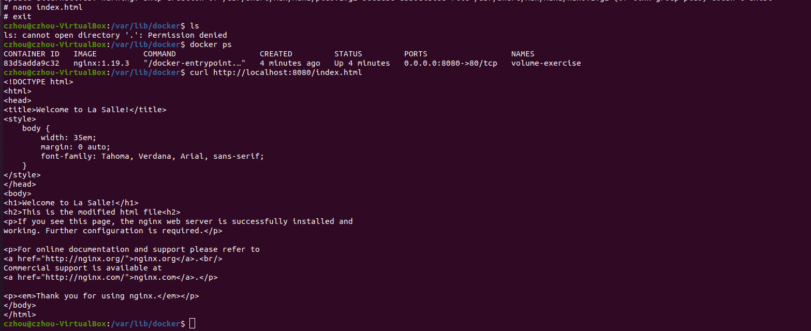
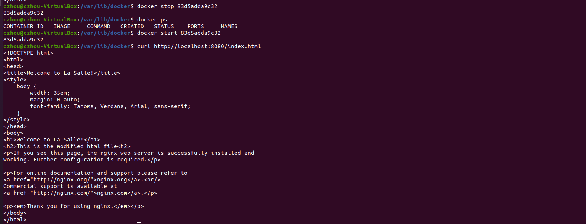
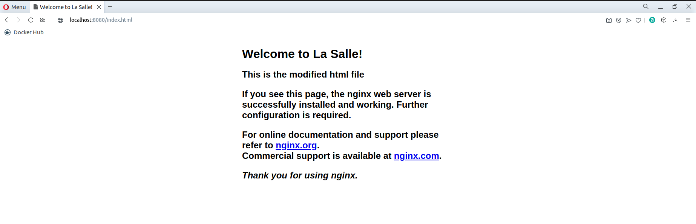

# hw-01-exercise-03

Crea un contenedor con las siguientes especificaciones:
1. Utilizar la imagen base NGINX haciendo uso de la versión 1.19.3

2. Al acceder a la URL localhost:8080/index.html aparecerá el mensaje
HOMEWORK 1

3. Persistir el fichero index.html en un volumen llamado static_content

## Answer

~~~~
docker volume create static_content
~~~~
- Creamos el volumen. Existen tres tipos de docker volumes:
 - Host volumes. El usuario decide en qué directorio del host se crea el volumen ---> _docker run -v [host directory]:[container directory]_
 - Anonymous volumes. Creados automáticamente por Docker, sin necesidad de saber el host path ---> _docker run -v [container directory]_
 - Named volumes. Como los anónimos pero especificando el nombre de la carpeta (nuestro caso) --> _docker run -v [name]:[container directory]_

~~~~
docker volume inspect static_content
~~~~
- Podemos inspeccionar el volumen creado.

~~~~
docker run \
  -d \
  -v static_content:/usr/share/nginx/html/ \
  -p 8080:80 \
  --name volume-exercise \
  nginx:1.19.3
~~~~
- Iniciamos el contenedor como daemon (-d) a partir de la imagen base _nginx_, versión 1.19.3 (nginx:1.19.3).
- Mapeamos el puerto 80 del contenedor, al 8080 de nuestro localhost (-p 8080:80).
- Le damos el nombre _volume-exercise_ al contenedor (--name volume-exercise).
- Montamos/enchufamos nuestro volumen local al directorio donde se encuentra el index.html dentro del contenedor (-v static_content:/usr/share/nginx/html/). De esta manera se persisten los cambios en los archivos html. Cualquier modificación en esta parte del filesystem virtual se replicará en el volumen del filesystem host.

~~~~
curl http://localhost:8080/index.html
~~~~
- Vemos el contenido de index.html

Si se edita el index.html, se detiene el contenedor y se vuelve a arrancar, se podrá comprobar que no se han perdido las modificaciones.

