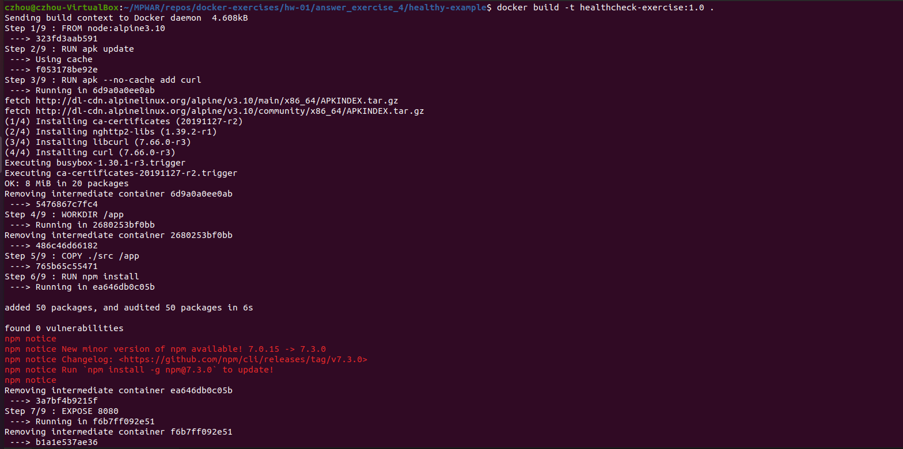
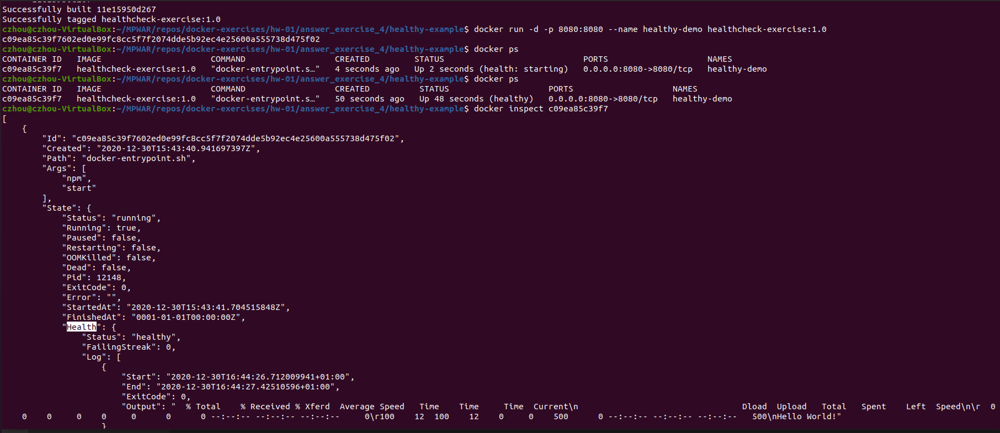
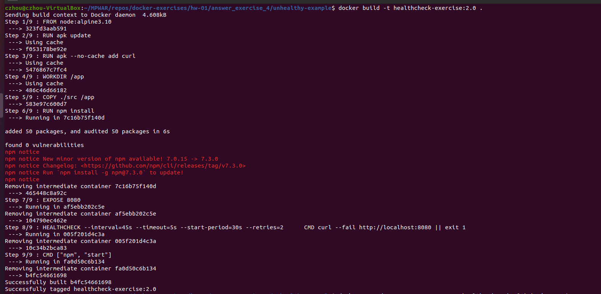
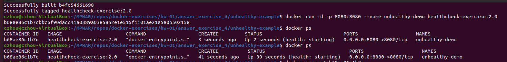
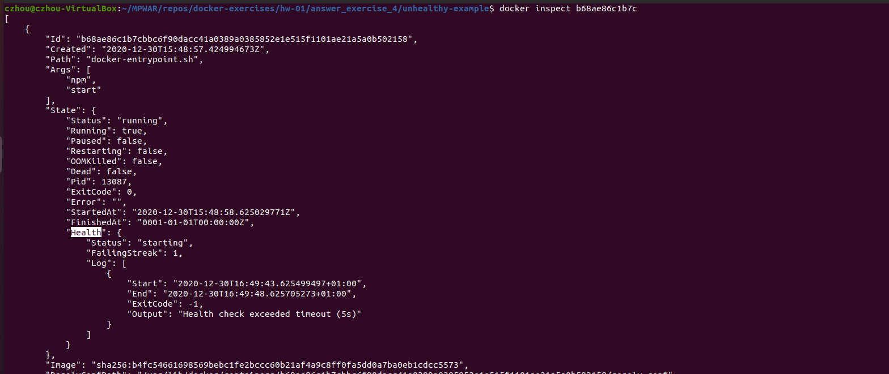
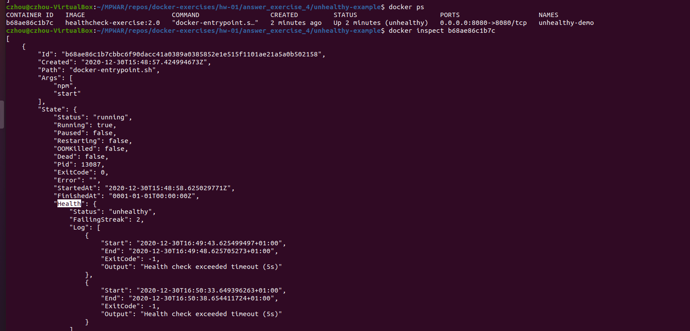

# hw-01-exercise-04

Crea una imagen docker a partir de un Dockerfile. Esta aplicación
expondrá un servicio en el puerto 8080 y se deberá hacer uso de la instrucción
HEALTHCHECK para comprobar si la aplicación está ofreciendo el servicio o por
si el contrario existe un problema.

El healthcheck deberá parametrizarse con la siguiente configuración:
- La prueba se realizará cada 45 segundos
- Por cada prueba realizada, se esperará que la aplicación responda en
menos de 5 segundos. Si tras 5 segundos no se obtiene respuesta, se
considera que la prueba habrá fallado
- Ajustar el tiempo de espera de la primera prueba (Ejemplo: Si la aplicación
del contenedor tarda en iniciarse 10s, configurar el parámetro a 15s)
- El número de reintentos será 2. Si fallan dos pruebas consecutivas, el
contenedor deberá cambiar al estado “unhealthy”)

## Answer

Ejemplo: app en node.js que usa librería express para publicar una REST API

### A. Healthy example
(ver en carpeta: _healthy-example_)

Dockerfile
~~~~
FROM node:alpine3.10

RUN apk update

RUN apk --no-cache add curl

WORKDIR /app

COPY ./src /app

RUN npm install

EXPOSE 8080

HEALTHCHECK --interval=45s --timeout=5s --start-period=30s --retries=2  \
    CMD curl --fail http://localhost:8080 || exit 1

CMD ["npm", "start"]
~~~~

- Basamos nuestra imagen en una de _node_, versión _alpine3.10_ (compressed size: 37.94MB, en comparación a los 332.13MB de la versión _current-buster_)

- Hacemos update e instalamos curl.

- Creamos y accedemos al directorio _app_

- Copiamos el código de nuestra aplicación en dicha carpeta dentro del contenedor.

- Ejecutamos un _npm install_

- Exponemos el 8080 como puerto de la aplicación.

- De acuerdo con el enunciado, definimos el healthcheck con las opciones (NOTE) requeridas

- Con el comando _curl_ podemos verificar que la apliación está corriendo haciendo la petición a localhost:8080 (al iniciar el contenedor mapearemos el puerto a nuestro 8080). Si la petición devuelve un 200, obtendremos un exit code 0; si la aplicación cae, el exit code será 1.

- Definimos el arranque de la aplicación como el comando de entrada por defecto.

  NOTE El comando HEALTHCHECK se puede usar con cuatro opciones:
    - --interval=[segundos a esperar inicialmente antes de ejecutar el healthcheck y frecuencia en la que se ejecutarán las pruebas] (default: 30s)
    - --timeout=[segundos a esperar el exit code antes de declarar la prueba como fallida y app como unhealthy] (default: 30s)
    - --start-period=[segundos para esperar el arranque de la aplicación y no declarar como unhealthy en caso de retornar un exit code mayor que 0] (default: 0s)
    - --retries=[número de reintentos fallidos consecutivos tras los cuales se declara el contenedor como unhealthy] (default: 3)

BUILD
~~~~
docker build -t healthcheck-exercise:1.0 .
~~~~

RUN
~~~~
docker run -d -p 8080:8080 --name healthy-demo healthcheck-exercise:1.0
~~~~

CHECK

- El _status_ inicialmente es _Up [tiempo]_. Lleva un tiempo iniciar el healthcheck y ver si la aplicación está healthy o unhealthy.

- Podemos ir revisando el status con _docker ps_ e inspeccionar el contenedor con _docker inspect [containerName/containerID]_

### B. Unhealthy example
(ver en carpeta: _unhealthy-example_)

Modificamos el código del ejemplo anterior para forzar el malfuncionamiento de la app. Se edita el archivo _app.js_:
~~~~
const express = require('express')
const app = express()
const port = 8080

app.get('/', (req, res) => {
  // application crashes
})

app.listen(port, () => {
  console.log(`Exercise 4 example app listening at http://localhost:${port}`)
})
~~~~

Contruimos una imagen nueva con estos cambios a partir del mismo Dockerfile que el ejemplo anterior.

Iniciamos el contenedor y revisamos el status.

Si inspeccionamos vemos el fallo de la primera prueba.

Vemos que finalmente se declara la aplicación como unhealthy, después de 2 fallos consecutivos.

