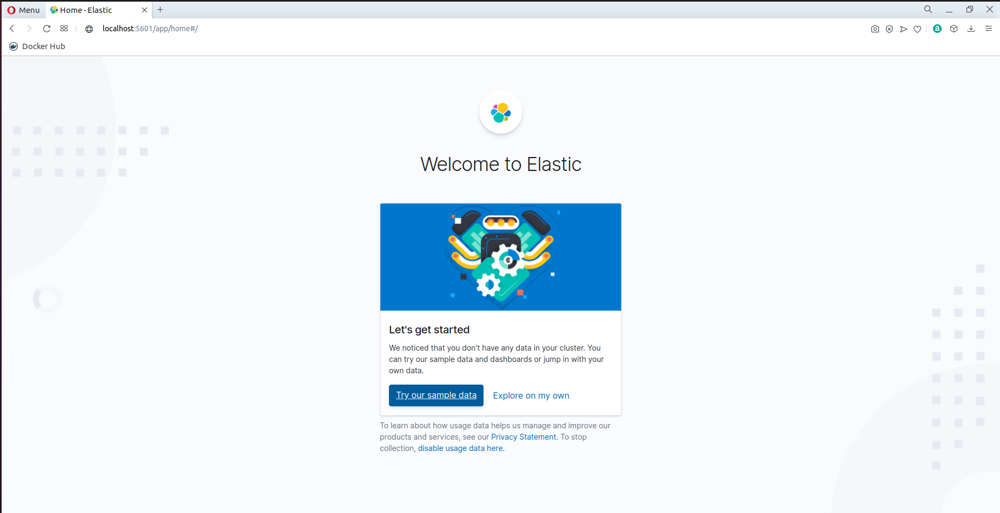
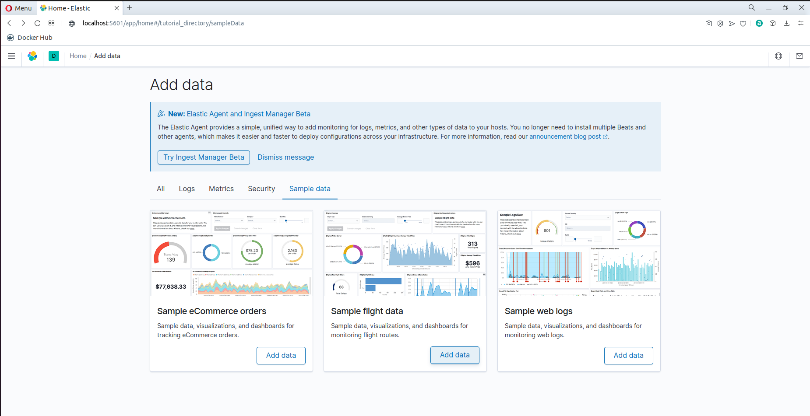
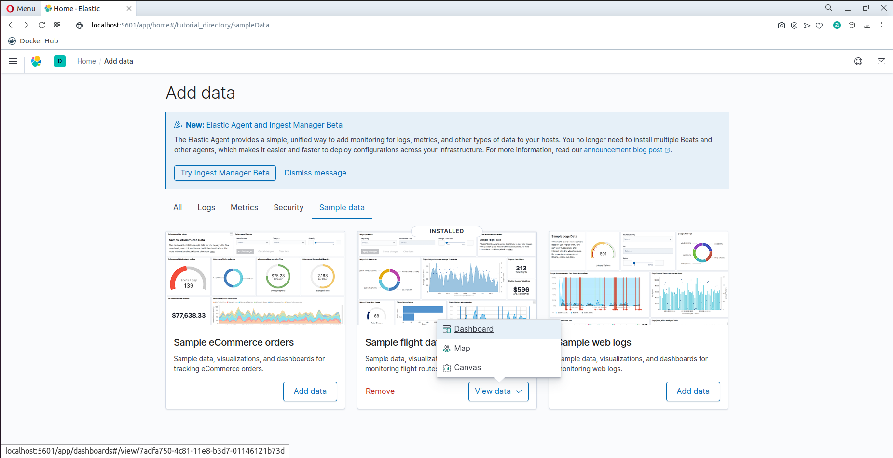
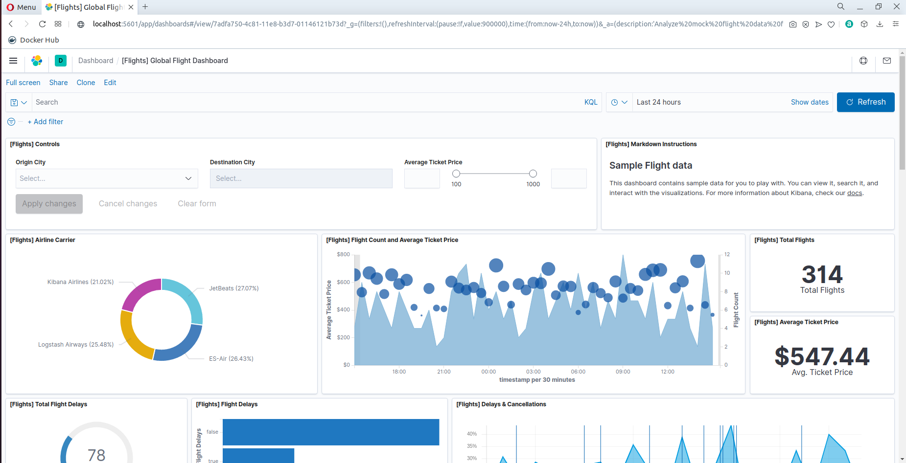

# hw-01-exercise-05

(Caso de uso) La compañía para la que trabajáis estudia la posibilidad de incorporar a nivel interno una herramienta para la monitorización de logs. Para ello, os han encomendado la tarea de realizar una “Proof of Concept” (PoC). 

Tras evaluar diferentes productos, habéis considerado que una buena opción es la utilización del producto Elastic stack, cumple con los requisitos y necesidades de la empresa. Tras comentarlo con el CTO a última hora de la tarde, os ha solicitado que preparéis una presentación para mañana a primera hora. Dado el escaso margen para montar la demostración, la opción más ágil y rápida es utilizar una solución basada en contenedores donde levantaréis el motor de indexación (ElasticSearch) y la herramienta de visualización (Kibana).

Rellena el siguiente fichero docker-compose para que podáis hacer la demostración al CTO.
~~~
version: '3.6'

services:

    elasticsearch:
    # Utilizar la imagen de elasticsearch v7.9.3
    ...

    # Asignar un nombre al contenedor
    ...

    # Define las siguientes variables de entorno:
    # discovery.type=single-node
    ...

    # Emplazar el contenedor a la red de elastic
    ...

    # Mapea el Puerto externo 9200 al puerto interno del contenedor 9200
    # Idem para el puerto 9300
    ...

    kibana:
    # Utilizar la imagen kibana v7.9.3
    ...

    # Asignar un nombre al contenedor
    ...

    # Emplazar el contenedor a la red de elastic
    ...

    # Define las siguientes variables de entorno:
    # ELASTICSEARCH_HOST=elasticsearch
    # ELASTICSEARCH_PORT=9200
    ...

    # Mapear el puerto externo 5601 al puerto interno 5601
    ...

    # El contenedor Kibana depe esperar a la disponibilidad del servicio elasticsearch
    ...

# Definir la red elastic (bridge)
...
~~~

## Answer

DOCKER-COMPOSE
~~~
version: '3.6'

services:
    elasticsearch:
      image: elasticsearch:7.9.3
      container_name: elasticsearch-01
      ports:
        - 9200:9200
        - 9300:9300
      environment:
        - discovery.type=single-node
      networks:
        - elastic

    kibana:
      image: kibana:7.9.3
      container_name: kibana-01
      ports:
        - 5601:5601
      environment:
        - ELASTICSEARCH_HOST=elasticsearch
        - ELASTICSEARCH_PORT=9200
      networks:
        - elastic
      depends_on:
        - elasticsearch

networks:
  elastic:
    driver: bridge 
~~~

RUN
~~~
docker-compose -f docker-compose.yaml up
~~~

CHECK
~~~
http://localhost:5601
~~~

_Try our simple data_: 

_Add data_:

_View data_ > _Dashboard_:

Resultado:

~~~
NOTE 1:
  Existen imágenes oficiales de elasticsearch y kibana en Docker Hub; también están en docker.elastic.co
  
NOTE 2: 
  Como prueba de concepto, se ha creado un docker-compose.yaml mínimo, pero como ejercicio y buena práctica, se podrían también limitar los recursos añadiendo a cada servicio (unidades de ejemplo): 

    deploy:
        resources:
          limits:
            cpus: '1'
            memory: 500M
          reservations:
            cpus: '0.50'
            memory: 200M
~~~
